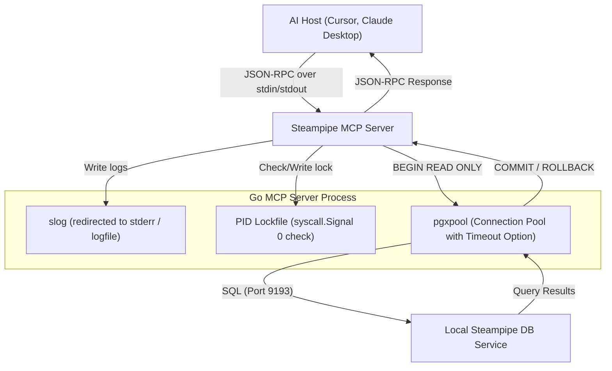

# Steampipe Go MCP Server: Comprehensive Architectural Specification & Implementation Plan

This document synthesizes the core Steampipe Model Context Protocol (MCP) server requirements with production-grade engineering patterns for Go-based MCP servers. By merging local SQL database introspection guidelines, single-instance lock safety, structured telemetry, and LLM-friendly schema discovery, this plan establishes a definitive blueprint for constructing a robust, high-performance, and resilient integration.

---

## 1. Directory Structure & Architecture

To support a clean, modular, and idiomatic Go project layout, the codebase will be organized into a single package under `cmd/steampipe-mcp/` until scale warrants a split.

```text
steampipe-mcp-golang/
├── cmd/steampipe-mcp/
│   ├── main.go        # Logging setup, PID lock, connection pool initialization, server run loop
│   ├── config.go      # Configuration loading, validation, and connection string sanitization
│   ├── db.go          # pgxpool connection management, statement timeouts, and transactional helpers
│   ├── tools.go       # Tool schemas (RawMessage) and callback handlers
│   │                  #   - steampipe_plugin_list, steampipe_table_list,
│   │                  #     steampipe_table_show, steampipe_query
│   ├── resource.go    # URI resource definition for status check ('steampipe://status')
│   └── prompt.go      # Predefined system instructions ('best_practices')
├── tools/
│   └── pydantic_ai_test_mcp.py  # End-to-end Pydantic AI MCP test harness (see §12)
├── Makefile           # build, run, test, fmt, vet, install utilities
├── README.md          # Project introduction and user configuration guide
├── go.mod             # Go module definition (verify owner matches the actual GitHub repo before `go mod init`)
└── go.sum             # Go dependency lockfile
```

### Runtime Dependencies (pinned)

| Module | Version | Purpose |
| :--- | :--- | :--- |
| `github.com/modelcontextprotocol/go-sdk` | `v1.4.1` | `mcp.StdioTransport`, `mcp.Server`, `mcp.Tool`, `mcp.CallToolResult`, `mcp.TextContent` |
| `github.com/jackc/pgx/v5` | `v5.x` (latest stable) | Postgres driver used to talk to Steampipe's FDW |
| `github.com/jackc/pgx/v5/pgxpool` | (bundled) | Connection pool with `AfterConnect` hook |
| `golang.org/x/sys/unix` | latest | `unix.Flock` for the single-instance lock |

The `tools.go`, `resource.go`, and `prompt.go` files register handlers against a single `mcp.Server` constructed in `main.go`. The MCP SDK serializes JSON-RPC dispatch per stdio session, but tool handlers must still be goroutine-safe — the `pgxpool.Pool` is, and the in-memory state we keep (logger, config) is read-only after init.

### Decoupled Communication Flow


---

## 2. Telemetry, Logging & STDIO Isolation

In a Stdio-based MCP server, **isolation of standard output is critical**. Any writes to `stdout` that are not valid JSON-RPC messages will corrupt the protocol channel and cause immediate client disconnection.

### Key Guidelines
1. **Redirect Logger to Stderr**: Configure Go's structured logger `log/slog` to write exclusively to `os.Stderr`.
2. **File Logging Option**: Support writing to a dedicated log file (`STEAMPIPE_MCP_LOGFILE`) to let developers monitor system actions (`tail -f`) without cluttering standard error.
3. **LogLevel Control**: Support `STEAMPIPE_MCP_DEBUG=1` to toggle verbosity from `slog.LevelInfo` to `slog.LevelDebug`.

### Code Pattern: Telemetry Initialization
```go
// cmd/steampipe-mcp/main.go (Excerpt)
func setupLogger() (io.Closer, error) {
    level := slog.LevelInfo
    if os.Getenv("STEAMPIPE_MCP_DEBUG") != "" || os.Getenv("APP_DEBUG") != "" {
        level = slog.LevelDebug
    }

    var logWriter io.Writer = os.Stderr
    var fileCloser io.Closer

    if logFile := os.Getenv("STEAMPIPE_MCP_LOGFILE"); logFile != "" {
        f, err := os.OpenFile(logFile, os.O_CREATE|os.O_WRONLY|os.O_APPEND, 0o644)
        if err != nil {
            return nil, fmt.Errorf("failed to open log file: %w", err)
        }
        logWriter = f
        fileCloser = f
    }

    logger := slog.New(slog.NewTextHandler(logWriter, &slog.HandlerOptions{Level: level}))
    slog.SetDefault(logger)

    return fileCloser, nil
}
```

---

## 3. Single-Instance Safety (PID Lockfile)

Since AI hosts can spawn the MCP server multiple times during IDE reloads, configuration changes, or client restarts, we must establish a **single-instance lock** to prevent duplicate servers from competing for `stdin/stdout` or starving the database pool.

### Rules of Engagement
- Acquire an **advisory exclusive lock** on the lockfile using `unix.Flock(fd, LOCK_EX|LOCK_NB)`. The kernel releases this automatically when the process exits — even on `SIGKILL` — which removes the entire stale-PID-cleanup class of bugs.
- After the lock is held, write the current PID to the file as a human-readable diagnostic (so operators running `cat steampipe-mcp.lock` can identify the holder). The PID is informational only; it is **not** the source of truth for liveness.
- The default lock path is `steampipe-mcp.lock` in the current working directory.
- Allow turning this safety mechanism off using `STEAMPIPE_MCP_LOCKFILE=off` for custom execution environments or automated test runs.
- Always return a non-nil cleanup function from `acquireLock` so callers can `defer cleanup()` unconditionally. The cleanup closes the locked fd (which releases the flock) and best-effort removes the file.

### Why flock over `syscall.Signal(0)` PID polling

The Signal(0) approach has a TOCTOU race: between the liveness check, the `os.Remove`, and the `O_EXCL` create, two starting instances can both observe a stale lock, both delete it, and both succeed at the create. `flock` is checked atomically by the kernel. It is reliable on Darwin and Linux (the only supported platforms here); a Windows build would need a separate path using `LockFileEx`.

### Code Pattern: Flock-Based Lock Acquisition
```go
// cmd/steampipe-mcp/main.go (Excerpt)
import "golang.org/x/sys/unix"

func acquireLock(lockFile string) (func(), error) {
    cleanup := func() {} // always safe to defer
    if strings.EqualFold(lockFile, "off") {
        return cleanup, nil
    }

    f, err := os.OpenFile(lockFile, os.O_CREATE|os.O_RDWR, 0o644)
    if err != nil {
        return cleanup, fmt.Errorf("unable to open lock file: %w", err)
    }

    if err := unix.Flock(int(f.Fd()), unix.LOCK_EX|unix.LOCK_NB); err != nil {
        // Best-effort: read whatever PID is in the file for the error message.
        existing, _ := os.ReadFile(lockFile)
        _ = f.Close()
        return cleanup, fmt.Errorf("another instance is running (pid file: %q): %w",
            strings.TrimSpace(string(existing)), err)
    }

    // We hold the lock — overwrite the file with our PID for diagnostics.
    if err := f.Truncate(0); err != nil {
        _ = unix.Flock(int(f.Fd()), unix.LOCK_UN)
        _ = f.Close()
        return cleanup, fmt.Errorf("unable to truncate lock file: %w", err)
    }
    if _, err := fmt.Fprintf(f, "%d\n", os.Getpid()); err != nil {
        _ = unix.Flock(int(f.Fd()), unix.LOCK_UN)
        _ = f.Close()
        return cleanup, fmt.Errorf("unable to write PID: %w", err)
    }

    return func() {
        slog.Debug("Releasing PID lock file", "path", lockFile)
        _ = unix.Flock(int(f.Fd()), unix.LOCK_UN)
        _ = f.Close()
        _ = os.Remove(lockFile)
    }, nil
}
```

---

## 4. Graceful Shutdown & Context Propagation

Proper lifecycle management ensures that all open connections are drained cleanly upon client disconnects or system exits, preventing dangling Postgres socket states.

- Capture `SIGINT` and `SIGTERM` signals.
- Trigger shutdown of the JSON-RPC server and close the `pgxpool` database connection pool.
- Propagate a cancellation `context.Context` from the root of the server down through every tool execution.

---

## 5. Database Connection & Session Configuration

Upon connecting to Steampipe, the server must configure PostgreSQL session limits per connection in the pool, ensuring system safeguards are set.

### Connection Requirements
1. **Timeout Setting**: Execute `SET statement_timeout = <ms>;` in an `AfterConnect` hook on the pool to avoid hanging queries. The value comes from `STEAMPIPE_MCP_STATEMENT_TIMEOUT_MS` (default `120000`). Steampipe queries that fan out across slow plugins (e.g. `aws_cloudtrail_event`, `github_search_*`) routinely exceed two minutes, so operators need a knob.
2. **Read-Only Transaction (defense-in-depth)**: Wrap every request in `BEGIN TRANSACTION READ ONLY` / `COMMIT`:
   ```sql
   BEGIN TRANSACTION READ ONLY;
   -- <user query here>
   COMMIT;
   ```
   Steampipe's FDW data is already read-only by nature; what this primarily prevents is writes to local Postgres state (e.g. the `internal` schema, temp tables). Treat it as belt-and-suspenders, not as the security boundary — that boundary is the absence of write-capable plugins on the connected instance.
3. **Connection Sanitization**: Scrub passwords and sensitive parameters in database connection strings when exposing them in logs or through the `status` resource.

### Code Pattern: Secure Connection Management
```go
// cmd/steampipe-mcp/db.go (Excerpt)
func NewConnectionPool(ctx context.Context, connStr string) (*pgxpool.Pool, error) {
    config, err := pgxpool.ParseConfig(connStr)
    if err != nil {
        return nil, err
    }

    // Set connection pool session settings on connect.
    // statement_timeout is configurable via STEAMPIPE_MCP_STATEMENT_TIMEOUT_MS (default 120000).
    // Postgres SET does not accept bind parameters, so use set_config() — which does — to
    // keep this safe even if statementTimeoutMs is sourced from user-controlled config.
    config.AfterConnect = func(ctx context.Context, conn *pgx.Conn) error {
        _, err := conn.Exec(ctx,
            "SELECT set_config('statement_timeout', $1, false)",
            strconv.Itoa(statementTimeoutMs))
        return err
    }

    return pgxpool.NewWithConfig(ctx, config)
}

func ExecuteReadOnlyQuery(ctx context.Context, pool *pgxpool.Pool, query string, args ...any) ([]map[string]any, error) {
    tx, err := pool.BeginTx(ctx, pgx.TxOptions{AccessMode: pgx.ReadOnly})
    if err != nil {
        return nil, fmt.Errorf("failed to start read-only transaction: %w", err)
    }
    defer func() { _ = tx.Rollback(ctx) }()

    rows, err := tx.Query(ctx, query, args...)
    if err != nil {
        return nil, err
    }
    defer rows.Close()

    // Parse column maps dynamically...
    var results []map[string]any
    // ... Parsing code goes here ...

    if err := tx.Commit(ctx); err != nil {
        return nil, fmt.Errorf("transaction commit failed: %w", err)
    }

    return results, nil
}
```

---

## 6. Progressive Schema Discovery & Token Optimization

Exposing database structures using **Progressive Disclosure** is the most effective way to help the LLM generate highly accurate SQL without overflowing its token context window.

### Schema Interaction Flow
1. **Step 1: List Plugins & Tables**: The LLM queries `steampipe_plugin_list` and `steampipe_table_list` to find available connections (e.g. AWS, Github) and high-level table names.
2. **Step 2: Table Introspection**: When a relevant table is identified (e.g., `aws_s3_bucket`), the LLM invokes `steampipe_table_show` to inspect column types, nullable rules, and descriptions.
3. **Step 3: Direct Query Execution**: Only after acquiring schema details does the LLM construct and call `steampipe_query`.

### Output Representation Guidelines
- **DDL & Markdown Output**: Surfacing table structural details in a combination of **Markdown tables** or **SQL DDL syntax** is highly optimized. LLMs read DDL syntax natively with perfect accuracy. It reduces token overhead by 15-20% compared to serialized JSON maps.

### `best_practices` Prompt (drafted content)

The `best_practices` prompt is registered with the MCP server and surfaced to the LLM as a system-level instruction. It is the primary lever for steering the model through the discovery flow above. Treat the text below as the canonical version — `prompt.go` should embed it verbatim:

```text
You are working with Steampipe, a Postgres FDW that exposes cloud and SaaS APIs as SQL tables. Use these tools in this order:

1. `steampipe_plugin_list` — discover which plugins (aws, github, gcp, kubernetes, …) are connected. Skip this step only if the user already named a plugin.
2. `steampipe_table_list` — list tables for the relevant plugin(s). Filter by plugin prefix (e.g. tables starting with `aws_`) to keep the response small.
3. `steampipe_table_show` — inspect a specific table's columns, types, and descriptions BEFORE writing SQL. Steampipe tables often have hundreds of columns; guessing column names will fail.
4. `steampipe_query` — only now run the SQL. Always project specific columns (avoid `SELECT *`) and add a `LIMIT` for exploratory queries.

Worked example: "Find S3 buckets without versioning."
- Call `steampipe_table_show` with table=`aws_s3_bucket` to confirm `versioning_enabled` is the right column.
- Then `steampipe_query` with: `SELECT name, region, versioning_enabled FROM aws_s3_bucket WHERE versioning_enabled IS NOT TRUE LIMIT 50;`

Rules:
- If a query times out, narrow it (tighter WHERE, fewer columns, smaller LIMIT) — do not retry the same query.
- If a query returns `truncated: true`, the result was capped for transport safety. Add filters or LIMIT/OFFSET to page through.
- All queries run inside a READ ONLY transaction; INSERT/UPDATE/DELETE will fail.
- Never fabricate column names — call `steampipe_table_show` first when uncertain.
```

### `steampipe://status` Resource Shape

The single resource exposed by the server reports server health and a sanitized view of its configuration. The body is JSON (`mimeType: "application/json"`):

```json
{
  "server_version": "0.1.0",
  "go_version": "go1.23.4",
  "started_at": "2026-05-28T14:02:11Z",
  "uptime_seconds": 1287,
  "database": {
    "connection_string": "postgresql://steampipe@localhost:9193/steampipe",
    "reachable": true,
    "statement_timeout_ms": 120000,
    "pool": { "acquired": 1, "idle": 2, "max": 10 }
  },
  "steampipe": {
    "plugin_count": 4,
    "table_count": 312
  },
  "last_query": {
    "at": "2026-05-28T14:23:01Z",
    "duration_ms": 184,
    "rows_returned": 47,
    "truncated": false
  },
  "limits": {
    "row_limit": 1000,
    "payload_limit_bytes": 1048576
  }
}
```

The `connection_string` is **always sanitized** — passwords, query-string credentials, and any non-essential parameters are stripped before serialization. `last_query` is omitted entirely until the first query runs. `database.reachable` is determined by a fresh `SELECT 1` ping, not cached pool state.

---

## 7. Intelligent Error Handling & LLM Self-Correction

To unlock the full potential of an AI assistant, we must map query-related exceptions gracefully.

> [!IMPORTANT]
> If a query fails due to a syntax typo, a missing column, or an incorrect table reference, the server should **NOT** return a hard JSON-RPC protocol error (which halts client execution). Instead, return a standard `CallToolResult` with `IsError` set to `true`, embedding the database message. 
> This provides a feedback loop that enables the LLM to inspect the failure, correct its query, and run it again automatically.

### Error Resolution Matrix

| Cause | Error Context | Actionable Message returned in `CallToolResult` |
| :--- | :--- | :--- |
| **SQL Typo / Typo** | Syntax Exception | `"SQL syntax error: <postgres_msg>"` |
| **Relation Missing** | Missing Table/Column | `"Relation not found: <postgres_msg>"` |
| **Timeout Triggered** | statement_timeout | `"Query exceeded statement_timeout (<configured> ms). Try a tighter WHERE, LIMIT, or fewer columns; or raise STEAMPIPE_MCP_STATEMENT_TIMEOUT_MS."` |
| **Service Down** | Connection Refused | `"Cannot reach Steampipe at <sanitized-host:port>. Verify the service is running and STEAMPIPE_MCP_WORKSPACE_DATABASE points at it."` |

---

## 8. Stdio JSON-RPC Argument Parsing Safety

When unmarshaling tool-call arguments (`req.Params.Arguments`):

- **Always parse into a typed struct, never `map[string]any`.** This pushes the type discipline into one place (`json.Unmarshal`), eliminates the float64 cast footgun for numeric arguments, and produces a usable schema for the tool's input definition. JSON numbers in Go default to `float64` when unmarshaled into `any`; a struct field of type `int` skips that path entirely.
- Treat `req.Params.Arguments` as `json.RawMessage` until you know which tool was invoked, then unmarshal into the matching struct.
- On unmarshal failure, return a `CallToolResult{IsError: true}` with the validation message — do **not** propagate the error as a JSON-RPC protocol error (see §7).

```go
// cmd/steampipe-mcp/tools.go (Excerpt)
type queryArgs struct {
    SQL    string `json:"sql"`
    Limit  int    `json:"limit,omitempty"`  // int, not float64 — no cast needed
}

func handleQuery(ctx context.Context, req *mcp.CallToolRequest) (*mcp.CallToolResult, error) {
    var args queryArgs
    if err := json.Unmarshal(req.Params.Arguments, &args); err != nil {
        return errorResult(fmt.Sprintf("invalid arguments: %v", err)), nil
    }
    if strings.TrimSpace(args.SQL) == "" {
        return errorResult("argument 'sql' is required"), nil
    }
    // ... execute via ExecuteReadOnlyQuery ...
}
```

---

## 9. Result Size Guard (Safeguards)

To prevent the MCP transport layer from choking on large database scans, the server caps results in two places — **at iteration time** and **at serialization time** — and signals truncation in-band so the LLM can react.

### Rules

1. **Row cap (`STEAMPIPE_MCP_ROW_LIMIT`, default 1000):** count rows during `rows.Next()` and stop iterating once the cap is reached. **Do not rewrite the user's SQL** to inject a `LIMIT` clause — that changes semantics (e.g. silently invalidates aggregates and breaks any user-supplied `ORDER BY ... LIMIT N`). Iteration-time capping is purely a transport guard.
2. **Payload cap (`STEAMPIPE_MCP_PAYLOAD_LIMIT_BYTES`, default 1 MiB):** measure the serialized JSON length before returning. If it exceeds the cap, drop trailing rows until it fits.
3. **In-band signaling:** when truncation occurs at either layer, the result envelope MUST include `"truncated": true`, the row count actually returned, and the trigger (`"row_cap"` or `"payload_cap"`). The accompanying `TextContent` should carry a short human-readable hint.

### Result Envelope (truncated case)
```json
{
  "rows": [ /* ... */ ],
  "row_count": 1000,
  "truncated": true,
  "truncation_reason": "row_cap",
  "hint": "Returned the first 1000 rows. Add a WHERE clause, project specific columns, or include LIMIT/OFFSET in your SQL to page through more."
}
```

---

## 10. Operational Guidelines: "The Plugin Gotcha"

Steampipe relies on user context paths (`~/.steampipe/db` and `~/.steampipe/plugins`) to locate, load, and run external plugins.
- When configuring the MCP server inside Claude Desktop or Cursor, ensure that the Steampipe service is running under the **same user session** that installed the plugins.
- If Steampipe is launched as a daemon, verify that the `$HOME` environment variable is explicitly set and matches the user's home path.

---

## 11. Configuration Environment Variables

| Variable | Default Value | Description |
| :--- | :--- | :--- |
| `STEAMPIPE_MCP_WORKSPACE_DATABASE` | `postgresql://steampipe@localhost:9193/steampipe` | Main connection string to Steampipe Postgres |
| `STEAMPIPE_MCP_WORKSPACE_DATABASE_PASSWORD` | `""` | Optional password for connection string (falls back to `PGPASSWORD` if unset) |
| `STEAMPIPE_MCP_LOGFILE` | `""` | Optional file path to output service logs |
| `STEAMPIPE_MCP_DEBUG` | `""` | Enable verbose debug logging if set to `1` or `debug` |
| `STEAMPIPE_MCP_LOCKFILE` | `"steampipe-mcp.lock"` | File path of the single-instance lock (set to `off` to disable) |
| `STEAMPIPE_MCP_ROW_LIMIT` | `"1000"` | Maximum number of rows to return before truncating outputs |
| `STEAMPIPE_MCP_STATEMENT_TIMEOUT_MS` | `"120000"` | Postgres `statement_timeout` applied to every pooled connection (milliseconds) |
| `STEAMPIPE_MCP_PAYLOAD_LIMIT_BYTES` | `"1048576"` | Soft cap on the serialized JSON payload size before truncation kicks in |

---

## 12. Verification & Automated Tests

Verification has three layers: Go unit tests for pure logic, Go integration tests behind a build tag, and an LLM-driven end-to-end harness in Python.

### Go Unit Tests (`*_test.go`)

These run on every `go test ./...` and require no external services. Each one targets a specific failure mode that is hard to catch in integration:

| Target | What it asserts |
| :--- | :--- |
| **Connection-string redaction** | Passwords, `password=` query params, and inline credentials in `postgres://` URLs are stripped before reaching logs or `steampipe://status`. |
| **Error classifier (§7 matrix)** | `pgconn.PgError` codes (`42601` syntax, `42P01` undefined_table, `57014` query_canceled / statement_timeout) and `net.OpError` "connection refused" each map to the right `CallToolResult.IsError` payload and message template. |
| **Row + payload truncation (§9)** | Iterating `> RowLimit` rows stops at the cap and emits `truncated:true, truncation_reason:"row_cap"`. Serialized payloads above `PayloadLimitBytes` drop trailing rows and emit `truncation_reason:"payload_cap"`. The user's SQL is never rewritten. |
| **Lockfile liveness** | A held `unix.Flock` blocks a second `acquireLock` call with a clear error; releasing the fd unblocks a subsequent acquire. A zero-byte lockfile left over from a crash is reusable on next startup. |
| **JSON arg unmarshal** | Tool handlers reject missing required fields and malformed JSON with `IsError:true` (not a JSON-RPC protocol error). Numeric fields decode as `int`, not `float64`. |

### Go Integration Tests (`//go:build integration`)

Gated behind `go test -tags=integration ./...`. These require a live local Steampipe service (`steampipe service start`) and exercise:
- pool initialization with the configured `statement_timeout`,
- a successful `steampipe_query` round trip against a built-in table (e.g. `steampipe_table`),
- a deliberately slow query that should hit the timeout and return the §7 timeout message,
- writes (`CREATE TABLE …`) inside the read-only transaction returning an error rather than succeeding.

### Python LLM Harness (`tools/pydantic_ai_test_mcp.py`)

Modeled directly on [`mdfranz/osqueryi-mcp`](https://raw.githubusercontent.com/mdfranz/osqueryi-mcp/refs/heads/main/tools/pydantic_ai_test_mcp.py)'s `pydantic_ai_test_mcp.py`, the harness drives a real LLM through `MCPServerStdio` against the built `steampipe-mcp-golang` binary and verifies the discovery flow end to end.

Carry over from osqueryi-mcp without modification:
- **Logging setup** — DEBUG to file, INFO to console; bumps `mcp`, `httpx`, `pydantic_ai` to DEBUG.
- **`PROVIDERS` table + `resolve_model()`** — accept a bare model name like `claude-haiku-4-5`, `gpt-4o-mini`, or `gemini-2.5-flash`; auto-prefix with the provider; verify the matching API key is in the environment; bail with a clear error if not.
- **Token accounting** — `TokenUsageTotals` and `RunStats` dataclasses, plus the `after_model_request` hook that logs per-turn token counts.
- **CLI shape** — `python pydantic_ai_test_mcp.py [model_name]` with a sensible default (e.g. `claude-haiku-4-5`).

Replace osqueryi-specific bits with Steampipe equivalents:
- **Server lookup** — `shutil.which("steampipe-mcp-golang")` instead of `osqueryi-mcp`.
- **Default env vars** — `os.environ.setdefault("STEAMPIPE_MCP_LOCKFILE", "off")` and `STEAMPIPE_MCP_LOGFILE` to a temp path so a parallel desktop instance doesn't conflict.
- **`SYSTEM_PROMPT`** — mirrors the §6 `best_practices` prompt: "use plugin_list → table_list → table_show → query in that order; never `SELECT *`; always include LIMIT for exploratory queries; READ ONLY transaction in effect."
- **`TASKS`** — three Steampipe-shaped prompts:
  1. **Progressive discovery** — "Use the Steampipe MCP tools to discover which plugins are connected, then list five tables from the most populated plugin. Explain whether `steampipe_table_list` reduces round trips compared to grepping `steampipe_table_show` outputs."
  2. **Single-table query** — "Inspect a representative table for the connected plugin via `steampipe_table_show`, then run `steampipe_query` to return five rows projecting only the columns you'll discuss. End with a note on why projecting specific columns matters for token usage."
  3. **Truncation behavior** — "Run a query you expect to return more than 1000 rows. Confirm the result envelope reports `truncated: true`, then refine the query with WHERE/LIMIT to fit within the cap. Report which trigger fired (`row_cap` vs `payload_cap`)."

The harness asserts that all three tasks complete without raising, that each task's final answer is non-empty, and prints overall token totals — matching the osqueryi-mcp pattern. Failures fall through to `logger.exception`, which the surrounding shell script (or CI step) converts into a non-zero exit.

### Standard Build Automation (`Makefile`)
```makefile
.PHONY: all build run clean test test-integration fmt vet install

APP_NAME = steampipe-mcp-golang

all: fmt vet build

build:
	go build -o $(APP_NAME) ./cmd/steampipe-mcp

run:
	go run ./cmd/steampipe-mcp

test:
	go test -v ./...

test-integration:
	go test -tags=integration -v ./...

fmt:
	go fmt ./...

vet:
	go vet ./...

install: build
	mkdir -p $(HOME)/.local/bin
	cp $(APP_NAME) $(HOME)/.local/bin/

clean:
	rm -f $(APP_NAME)
	rm -f *.lock
```
