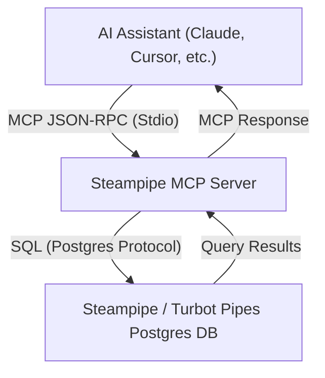
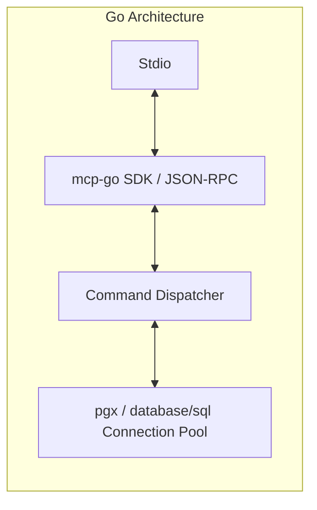

# Steampipe MCP Server: Multi-Language Implementation Specification & Plan

This specification outlines the architecture, data models, protocol schemas, and design guidelines for implementing the **Steampipe Model Context Protocol (MCP) Server** in a different programming language (specifically targeting **Go**, **Rust**, or **Python**).

---

## 1. Architectural Overview

The Steampipe MCP Server acts as a bridge between an AI Assistant (client) and a Steampipe PostgreSQL database instance. It translates standard Model Context Protocol JSON-RPC requests (sent via standard I/O) into SQL queries, executes them against Steampipe, and returns the result in JSON format.



### Protocol & Transport Constraints

> [!IMPORTANT]
> The server communicates via standard input/output (`StdioServerTransport`). Because stdout is used exclusively for JSON-RPC messages, **all logs, diagnostics, and debugging info must be written to stderr**. Any write to stdout that is not a valid JSON-RPC message will corrupt the communication channel and disconnect the client.

> [!IMPORTANT]
> **Go Implementation Note**: Ensure the chosen logger writes to `os.Stderr` (e.g. `log.New(os.Stderr, ...)` or a structured logger configured to stderr). Never `fmt.Println` to stdout outside the JSON-RPC transport.

---

## 2. Core Protocol Capabilities

To maintain feature parity with the reference TypeScript implementation, the server must support the following capabilities:

### A. Resources
Resources allow the AI client to read state from the server. The Steampipe MCP server exposes one resource:

| Resource Name | URI | MIME Type | Description |
| :--- | :--- | :--- | :--- |
| `status` | `steampipe://status` | `application/json` | Provides connection string and connection status (connected/disconnected). |

### B. Prompts
Prompts are pre-defined instructions that teach the AI assistant how to interact with the server.

| Prompt Name | Description | Purpose |
| :--- | :--- | :--- |
| `best_practices` | Best practices for writing Steampipe SQL queries | Instructs the LLM on using CTEs, selecting specific columns, indenting, and exploring schemas. |

### C. Tools
Tools are executable actions the AI assistant can call. The server exposes five tools:

| Tool Name | Parameters | Description |
| :--- | :--- | :--- |
| `steampipe_query` | `sql` (string) | Executes a read-only SQL query on the database. |
| `steampipe_table_list` | `schema` (optional string), `filter` (optional string) | Lists available Steampipe tables. |
| `steampipe_table_show` | `name` (string), `schema` (optional string) | Shows detailed column definitions and descriptions for a table. |
| `steampipe_plugin_list` | None | Lists installed Steampipe plugins. |
| `steampipe_plugin_show` | `name` (string) | Shows detailed plugin instance configuration. |

---

## 3. Database Specification & Schemas

### Database Connection and Session Settings

Upon establishing a connection to the Steampipe database, the server must execute the following session configuration:

```sql
SET statement_timeout = 120000; -- 120 seconds timeout to prevent hanging API calls
```

> [!IMPORTANT]
> **Connection Pooling Note (especially for Go)**: If using a connection pool, session settings must be applied **per connection**, not just once at startup. In Go, prefer setting `statement_timeout` in a pool `AfterConnect` hook or by passing connection `options` so every new pooled connection inherits it.

> [!CAUTION]
> **Read-Only Transaction Isolation**: To prevent write operations (such as updates, drops, or modifications to cloud/infrastructure tables), all queries executed by `steampipe_query` must run inside an explicit read-only transaction:
> ```sql
> BEGIN TRANSACTION READ ONLY;
> -- <user query here>
> COMMIT; -- or ROLLBACK on error
> ```

> [!IMPORTANT]
> **Go Implementation Note**: Use a context-aware, read-only transaction (`BeginTx` with read-only access mode), and always rollback on error. This is the primary guardrail that enforces “read-only” beyond simple SQL validation.

### Metadata Query Schemas

The following SQL schemas must be used internally by the tools to query Steampipe metadata:

#### 1. Table Listing (`steampipe_table_list`)
Queries all tables, optionally filtered by schema or table name patterns (`ILIKE` with wildcards). Table descriptions are retrieved using Postgres's `obj_description` function.

```sql
SELECT DISTINCT 
  table_schema as schema,
  table_name as name,
  obj_description(format('%I.%I', table_schema, table_name)::regclass::oid, 'pg_class') as description
FROM information_schema.tables
WHERE table_schema NOT IN ('information_schema', 'pg_catalog')
  -- Dynamic filters:
  -- AND table_schema = $1
  -- AND table_name ILIKE $2
ORDER BY table_schema, table_name;
```

#### 2. Table Schema Details (`steampipe_table_show`)
Retrieves structural details for a specific table, including column types and descriptions via `col_description`.

> [!IMPORTANT]
> **Schema-qualified names**: The `name` parameter may be schema-qualified (e.g. `aws.aws_account`). If `schema` is also provided, it takes precedence and `name` should be treated as the unqualified table name. If `schema` is not provided and `name` is schema-qualified, split into `(schema, table)` before querying.

```sql
SELECT 
  t.table_schema as schema,
  t.table_name as name,
  t.table_type as type,
  c.column_name,
  c.data_type,
  c.is_nullable,
  c.column_default,
  c.character_maximum_length,
  c.numeric_precision,
  c.numeric_scale,
  col_description(format('%I.%I', t.table_schema, t.table_name)::regclass::oid, c.ordinal_position) as description
FROM information_schema.tables t
LEFT JOIN information_schema.columns c 
  ON c.table_schema = t.table_schema 
  AND c.table_name = t.table_name
WHERE t.table_schema NOT IN ('information_schema', 'pg_catalog')
  AND t.table_name = $1
  -- Optional filter:
  -- AND t.table_schema = $2
ORDER BY c.ordinal_position;
```

#### 3. Plugin Listing (`steampipe_plugin_list`)
Queries Steampipe's internal `steampipe_plugin` table to list available integrations.

```sql
SELECT 
  plugin,
  version
FROM steampipe_plugin
ORDER BY plugin;
```

#### 4. Plugin Details (`steampipe_plugin_show`)
Retrieves granular properties for an installed plugin instance.

```sql
SELECT 
  plugin_instance,
  plugin,
  version,
  memory_max_mb,
  limiters,
  file_name,
  start_line_number,
  end_line_number
FROM steampipe_plugin
WHERE plugin = $1;
```

---

## 4. Error Mapping & Robustness

The Postgres client connection may fail due to local service issues or authentication failures. The server must handle the following standard database errors gracefully, providing clean, user-friendly messages:

| Error Type / Cause | Database Code | Actionable Message for AI / User |
| :--- | :--- | :--- |
| **Service Stopped / ECONNREFUSED** | `ECONNREFUSED` | `"Cannot connect to Steampipe database at <sanitized_url>. Please ensure Steampipe is running (e.g. 'steampipe service start')."` |
| **Authentication Failed** | `28P01` | `"Database authentication failed for <sanitized_url>. Please check your credentials."` |
| **Invalid Database** | `3D000` | `"Database does not exist at <sanitized_url>. Please check your connection string."` |
| **Invalid Role / Username** | `28000` | `"Database user/role does not exist for <sanitized_url>. Please check your credentials."` |
| **Connection Timed Out** | `57P03` | `"Database connection timed out for <sanitized_url>. The server might be overloaded or unreachable."` |
| **Connection Terminated** | `57P01` | `"Database connection terminated - Steampipe service may have been stopped. Please ensure Steampipe is running at <sanitized_url>."` |
| **Query Syntax Error** | Syntax Exception | `"SQL syntax error: <postgres_error_message>"` |
| **Table / View Not Found** | Relation Exception | `"Table or view not found: <postgres_error_message>"` |

> [!IMPORTANT]
> **Go Implementation Note**: Map both Postgres errors (e.g. via `PgError.Code`) and network/context errors (connection refused, DNS failure, context deadline exceeded). Prefer returning short, actionable messages with a sanitized connection string.

---

## 5. Security & Configuration Requirements

1. **Connection String Sanitization**:
   The database connection string can be supplied via the `STEAMPIPE_MCP_WORKSPACE_DATABASE` environment variable or as a command-line argument. Because the connection string often contains passwords, **any log entry referencing the connection string must scrub the password**:
   - *Pattern Match*: Parse as URL and replace the password component with `****` or mask the section between `:` and `@` matching `/:[^:@]+@/`.
   - **Resource output**: The `status` resource must also return a **sanitized** connection string. Do not return raw credentials to the client/LLM.
2. **Implicit Fallback**:
   The default connection string is `postgresql://steampipe@localhost:9193/steampipe` if no override is supplied.
3. **Graceful Shutdown**:
   Ensure listeners capture `SIGINT` and `SIGTERM` to close the database connection pool cleanly before exiting, avoiding dangling socket states.
4. **Result Size Guard (recommended)**:
   Add a soft limit for tool output size (rows and/or serialized bytes). If exceeded, return a friendly error instructing the user to add a `LIMIT` and/or narrow the selected columns. This prevents flooding stdio/JSON and improves reliability across clients.

---

## 6. Operational Assumptions & Service Configurations

To ensure seamless integration between the Steampipe PostgreSQL instance and the MCP Server, several crucial operational assumptions and configurations must be satisfied across Linux and macOS.

### A. Background Service Lifecycles
* **Steampipe Database Service**: Steampipe runs as an independent, daemonized background database service (usually via `steampipe service start` or system startup controllers like `systemd` or `launchd`). It exposes a PostgreSQL-compatible interface on port `9193` (by default).
* **MCP Server Process**: Stdio-based MCP servers are spawned on-demand and fully managed by the AI client (e.g., Claude Desktop, Cursor). The client manages the child process's lifetime automatically; hence, the MCP server itself should **not** be run as a separate daemon.

### B. Static Authentication (Postgres Password)
* By default, local `steampipe service start` executions generate a randomized database password on every launch. 
* To prevent connection string breakage, the service must be run with a static, fixed password:
  ```bash
  steampipe service start --password your_secure_password --bind-address 127.0.0.1
  ```
* For remote or containerized access, set `--bind-address 0.0.0.0` and secure the interface with a strong password.

### C. Workspace User Context & Plugin Resolution ("The Plugin Gotcha")
* **Context Dependency**: Steampipe discovers, loads, and manages installed plugins (e.g. AWS, GCP) and connections relative to the active user's home directory context (`~/.steampipe/db` and `~/.steampipe/plugins`).
* **Service Owner Constraint**: If running Steampipe as a persistent system-wide daemon (e.g., systemd or launchd unit), the daemon **must** execute under the context of the specific user account who installed the plugins and configured the connections. Otherwise, Steampipe will boot but query engines will fail to locate plugins.
* **Environment Configuration**: When launching via automation services, explicitly define the target user's `$HOME` folder in the unit configuration:
  * **Systemd**: `User=your_username` and `Environment=HOME=/home/your_username`
  * **Launchd**: Specify the appropriate user domain or run as a User Agent rather than a System Daemon.

---

## 7. Implementation Language Comparison

Depending on your engineering preferences, three languages are highly suited for rewriting the Steampipe MCP server. Below is a detailed breakdown of libraries and structural recommendations for each language:

### Option A: Go (Golang)
Go is ideal for compiling into a single, high-performance, static binary with zero external runtime dependencies (unlike Node.js or Python).



* **Recommended MCP SDK**:
  - An MCP Go SDK that supports JSON-RPC over stdio (prefer a maintained SDK from the `modelcontextprotocol` ecosystem if available).
* **Recommended DB Driver**:
  - `github.com/jackc/pgx/v5` (High-performance, modern PostgreSQL driver with great connection pooling and support for standard JSON and numeric types).
* **Go-Specific Notes**:
  - **Single Binary**: The entire MCP server can be compiled into a static binary. This simplifies configuration enormously (e.g. `"command": "/path/to/steampipe-mcp"`).
  - **Integer Safety**: Go handles bigints safely (`int64`). `pgx` parses Postgres standard `bigint` columns into `int64` out of the box without precision loss.
  - **Goroutines**: Every incoming request can be processed concurrently with minimal memory usage.
  - **Context cancellation**: Plumb `context.Context` from the JSON-RPC request through to database calls so cancellations/timeouts propagate cleanly.

### Option B: Rust
Rust is excellent if you require absolute memory safety, minimal footprint, and lightning-fast startup times.

* **Recommended MCP SDK**:
  - `mcp-sdk-rs` (Community Rust SDK supporting JSON-RPC and stdio transports).
* **Recommended DB Driver**:
  - `sqlx` (Asynchronous, compile-time offline query validation, robust connection pooling) or `tokio-postgres` (Highly performant, low-level async Postgres client).
* **Rust-Specific Notes**:
  - **Async Execution**: Leveraging `tokio` allows for efficient non-blocking operations.
  - **Strict Typing**: Mapping database fields directly to strongly typed Structs using `serde` ensures robust JSON serialization.
  - **Error Handling**: Using Rust's `Result` type and `thiserror` crate makes error categorization and mapping exceptionally reliable.

### Option C: Python
Python is a great choice if you prioritize rapid development, readability, or integration with existing Python data-science and AI tools.

* **Recommended MCP SDK**:
  - `mcp` (The official Python MCP SDK from Anthropic/Model Context Protocol, supporting async handlers).
* **Recommended DB Driver**:
  - `asyncpg` (Highly optimized, asynchronous PostgreSQL client library) or `psycopg3` (The modern, standard sync/async Postgres driver).
* **Python-Specific Notes**:
  - **Asyncio**: Use `asyncio` to handle incoming JSON-RPC events without blocking the main event loop.
  - **Type Checking**: Utilize `pydantic` or `mypy` for strong typing around the parameters received by tools.
  - **Runtime**: Users will need a Python interpreter installed, meaning they must configure the MCP command as `["python", "/path/to/server.py"]` or wrap it in a virtual environment (`venv`).

---

## 8. Comparative Recommendations

| Dimension | Go | Rust | Python |
| :--- | :--- | :--- | :--- |
| **Ease of Deployment** | **Best** (Single compiled binary, no interpreter needed) | **Excellent** (Single compiled binary, no interpreter needed) | **Moderate** (Requires Python interpreter and dependencies/venv) |
| **Performance & Resource Footprint** | **Excellent** (Extremely low memory and CPU overhead) | **Best** (Fastest runtime, lowest RAM footprint) | **Good** (Higher memory overhead, standard Python process) |
| **Code Readability & Simplicity** | **Best** (Simple syntax, straightforward concurrency) | **Moderate** (Strict borrow checker and async complexity) | **Excellent** (Highly legible, rapid prototyping) |
| **SDK Maturity** | **Excellent** (Multiple community options) | **Good** (Evolving async SDKs) | **Best** (Official SDK maintained by Anthropic) |

> [!TIP]
> **Recommendation**:
> - If your goal is **maximum portability, simple setup, and static binaries** with a native feel, choose **Go**. It is incredibly robust, easy to read, and compiling to a single file avoids runtime configuration headaches for users.
> - If you want the **absolute lowest footprint and highest performance**, choose **Rust**.
> - If you need to **rapidly customize the tool or integrate with data science pipelines**, choose **Python**.
